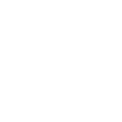
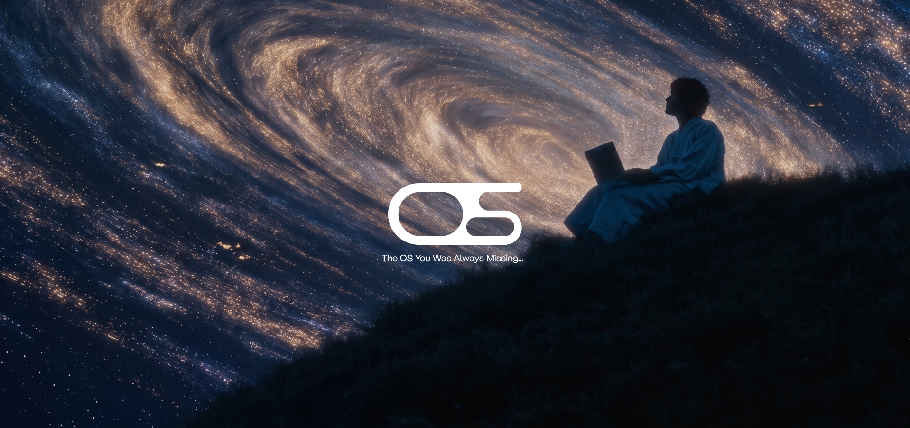

<div align="center">



# Project OS

**The OS You Were Always Missing**

*Transform every new Chrome tab into a hyper-customizable productivity command center.*

[](./LICENSE)
[](https://react.dev/)
[](https://vitejs.dev/)
[](https://tailwindcss.com/)
[](https://developer.chrome.com/docs/extensions/mv3/)
[](https://addons.mozilla.org/)
[](./CONTRIBUTING.md)
[](https://github.com/rahul3rj/Project-OS/stargazers)

<br/>

[**✨ Features**](#-features) · [**🚀 Quick Start**](#-quick-start) · [**🏗️ Architecture**](#️-project-structure) · [**🤝 Contributing**](./CONTRIBUTING.md) · [**📜 License**](./LICENSE)

</div>

<br/>



---

## 📌 Overview

**Project OS** is a cutting-edge Chrome New Tab Extension built with **React 19**, **Vite**, and **Tailwind CSS v4**. It replaces your standard blank new tab with an interactive, fully modular productivity dashboard — designed for developers, students, power users, and builders who live in the browser.

A companion **landing website** (`web/`) built with GSAP, Lenis smooth scroll, and a liquid-glass UI effect showcases the extension.

> 🔒 **100% local & private.** No accounts. No tracking. No telemetry. Your data never leaves your machine.

---

## ✨ Features

<table>
<tr>
<td width="50%">

### 🎨 Multi-Theme Engine
4 handcrafted visual themes:
- 💎 **Glassmorphism** — frosted glass, soft glows
- ⚡ **Cyberpunk** — neon HUD, scanline textures
- 🖋️ **Manga / Ink** — high-contrast monochrome
- 👾 **Pixel Art** — nostalgic 8-bit retro arcade

</td>
<td width="50%">

### 🧱 Drag & Drop Grid
- Physics-based drag & drop via `@dnd-kit`
- **Dashboard Grid** — multi-widget layout
- **Hero View** — distraction-free focus mode
- Widget toggle on/off on demand

</td>
</tr>
<tr>
<td>

### ⏰ Smart Clock & Greeting
- Real-time 12/24hr display
- Personalized dynamic greeting
- Live date, optional seconds ticker
- Theme-adaptive fonts & colors

</td>
<td>

### 🎯 Pomodoro Focus Timer
- Customizable work/rest durations
- Session counter & daily focus tracking
- Audio ringtone alerts
- Chrome notification support
- Syncs to activity streak log

</td>
</tr>
<tr>
<td>

### 🟩 GitHub Activity Matrix
- GitHub-style contribution heatmap
- Visualizes daily focus intensity
- Live GitHub commit sync support
- Long-term consistency streaks

</td>
<td>

### 🎵 Ambient Audio Player
- Lofi radio stations (Zeno.fm, FluxFM, Laut.fm)
- YouTube audio integration
- Spotify quick access
- Volume control & custom stream URLs

</td>
</tr>
<tr>
<td>

### 📅 Time-Boxing Planner
- Hourly habit & routine blocks
- Customizable task groups
- Subtask checklists + streak tracking
- Auto UTC midnight reset

</td>
<td>

### 💧 Hydration Tracker
- Interactive water intake monitor
- `+250ml / +500ml / custom` quick logs
- Visual hydration progress ring
- Timed audio reminders

</td>
</tr>
<tr>
<td>

### 🧭 Shortcuts
- Quick-launch bar: **Gemini**, **Claude**, **ChatGPT**, **Copilot**, **Perplexity**, **DeepSeek**
- Full CRUD for shortcuts
- Custom icon/favicon upload

</td>
<td>

### 💾 Backup & Restore
- Full JSON export/import of all settings
- `chrome.storage.local` — stays on your device
- Transfer seamlessly across machines

</td>
</tr>
</table>

---

## 🛠️ Tech Stack

| Layer | Technology |
|:---|:---|
| **Extension Framework** | [React 19](https://react.dev/) + [Vite 7](https://vitejs.dev/) |
| **Styling** | [Tailwind CSS v4](https://tailwindcss.com/) + Vanilla CSS Theme Engines |
| **Drag & Drop** | [@dnd-kit/core](https://dndkit.com/) + `@dnd-kit/utilities` |
| **Activity Graph** | `react-activity-calendar` |
| **Icons** | Remix Icon (`remixicon`) |
| **Extension API** | Chrome Manifest V3 (`chrome.storage.local`, `declarativeNetRequest`) |
| **Landing Site** | [GSAP 3](https://gsap.com/) + [Lenis](https://lenis.darkroom.engineering/) smooth scroll |
| **Build Tool** | Vite 7 (extension) · Vite 8 (web) |

---

## 🏗️ Project Structure

```
Chrome_Extension/
├── README.md                       # You are here
├── CONTRIBUTING.md                 # Contribution guidelines
├── CODE_OF_CONDUCT.md              # Community code of conduct
├── LICENSE                         # MIT License
│
├── Frontend/                       # Chrome Extension (Manifest V3)
│   ├── package.json
│   ├── vite.config.js
│   ├── index.html
│   ├── public/
│   │   ├── manifest.json           # Chrome Extension manifest
│   │   ├── rules.json              # declarativeNetRequest rules
│   │   └── logo.png
│   └── src/
│       ├── App.jsx                 # Root: state, storage sync, settings
│       ├── main.jsx
│       ├── index.css               # Global styles & design tokens
│       ├── components/
│       │   ├── DashboardGrid.jsx   # dnd-kit drag & drop layout
│       │   ├── HeroView.jsx        # Distraction-free focus view
│       │   ├── Clock.jsx           # Smart clock & greeting widget
│       │   ├── Taskbar.jsx         # Shortcuts quick-launch bar
│       │   ├── Timer.jsx           # Pomodoro focus timer
│       │   ├── Todo.jsx            # Task manager
│       │   ├── TimeBoxing.jsx      # Hourly routine planner
│       │   ├── StreakGrid.jsx      # GitHub-style activity matrix
│       │   ├── WaterReminder.jsx   # Hydration tracker
│       │   ├── SongPlayer.jsx      # Lofi & YouTube audio player
│       │   ├── ImportantTabs.jsx   # Categorized bookmarks
│       │   ├── SettingsPage.jsx    # Full settings & theme drawer
│       │   ├── FigmaGlassCard.jsx  # Frosted glass card wrapper
│       │   ├── IconPicker.jsx      # Custom icon picker UI
│       │   └── TimePicker.jsx      # Time picker component
│       ├── utils/
│       │   ├── storage.js          # Chrome storage wrapper
│       │   ├── activityStore.js    # Focus streak activity logger
│       │   ├── youtube.js          # YouTube player helper
│       │   └── spotify.js          # Spotify integration helper
│       └── themes/
│           ├── index.js            # Theme registry
│           ├── cyberpunk.css
│           ├── manga.css
│           └── pixel.css
│
└── web/                            # Landing Website
    ├── package.json
    ├── vite.config.js
    └── src/
        ├── App.jsx                 # Lenis + GSAP scroll orchestration
        ├── components/
        │   ├── Navbar.jsx
        │   ├── CursorFollower.jsx  # Magnetic custom cursor
        │   └── RippleButton.jsx    # Ripple-effect CTA button
        ├── sections/
        │   ├── Hero.jsx            # Liquid-glass CTA hero
        │   ├── Video.jsx           # Product showcase
        │   ├── Features.jsx        # Interactive feature cards
        │   ├── Themes.jsx          # Theme showcase carousel
        │   ├── Comparison.jsx      # Before/after comparison
        │   ├── Setup.jsx           # Installation guide
        │   ├── Contributions.jsx   # Contributors orbital display
        │   ├── FAQs.jsx            # Accordion FAQ
        │   └── Footer.jsx          # Footer with liquid-glass CTAs
        ├── data/
        │   └── contributors.json
        └── utils/
            └── useLiquidGlass.js   # WebGL liquid-glass hook
```

---

## 🚀 Quick Start

### Prerequisites

- [Node.js](https://nodejs.org/) `v18+`
- Google Chrome, Brave, Edge, Arc, or any Chromium-based browser
- Mozilla Firefox (also supported)

---

### 🔌 Option A — Load as Chrome Extension

**1. Clone the repository**

```bash
git clone https://github.com/rahul3rj/Project-OS.git
cd Project-OS
```

**2. Install dependencies & build**

```bash
cd Frontend
npm install
npm run build
```

**3. Load into Chrome**

1. Open `chrome://extensions` in your browser
2. Enable **Developer mode** (top-right toggle)
3. Click **Load unpacked**
4. Select the `Frontend/dist` folder

**4. Open a new tab and experience Project OS! 🎉**

---

### 💻 Option B — Development mode (UI-only)

```bash
cd Frontend
npm install
npm run dev
```

> ⚠️ The new-tab override requires the built extension. `npm run dev` is for fast UI iteration.

---

### ♻️ Rebuild after code changes

```bash
cd Frontend
npm run build
```

Then open `chrome://extensions` → click the **Reload** 🔄 icon on Project OS.

---

### 🌐 Run the Landing Website locally

```bash
cd web
npm install
npm run dev
```

---

## 🔐 Permissions & Privacy

Project OS requests only the minimum permissions required:

```json
"permissions": ["storage", "unlimitedStorage", "declarativeNetRequest"]
```

| Permission | Why it's needed |
|:---|:---|
| `storage` / `unlimitedStorage` | Saves themes, wallpapers, shortcuts, todos, timer stats **locally on your device only** |
| `declarativeNetRequest` | Enables smooth audio streaming for Lofi radio & YouTube embeds |

**No external servers. No analytics. No accounts. Ever.**

---

## ⭐ Star History

<a href="https://www.star-history.com/?repos=rahul3rj%2FProject-OS&type=date&legend=top-left">
 <picture>
   <source media="(prefers-color-scheme: dark)" srcset="https://api.star-history.com/chart?repos=rahul3rj/Project-OS&type=date&theme=dark&legend=top-left&sealed_token=feICPbEpd5x4bQxC4fkJssAKVsXtgyehUt8Tm1ifUlSmfHkIqWnpJUKunG5D1b3H2ir1EU44YNObRWS_OpePID54aup5x_keHfqH3ZiclOmURO7YGy-xb0JTE6DrkBekTDpZ9nC4e66wDUhkyF55bFWYPz2PEuSap9MB-iZkDP8VIUSRklVK56n6MbhL" />
   <source media="(prefers-color-scheme: light)" srcset="https://api.star-history.com/chart?repos=rahul3rj/Project-OS&type=date&legend=top-left&sealed_token=feICPbEpd5x4bQxC4fkJssAKVsXtgyehUt8Tm1ifUlSmfHkIqWnpJUKunG5D1b3H2ir1EU44YNObRWS_OpePID54aup5x_keHfqH3ZiclOmURO7YGy-xb0JTE6DrkBekTDpZ9nC4e66wDUhkyF55bFWYPz2PEuSap9MB-iZkDP8VIUSRklVK56n6MbhL" />
   
 </picture>
</a>

---

## 🤝 Contributing

Contributions are what make open source such an amazing place to learn, inspire, and create. **Any contribution you make is greatly appreciated.** 💙

Read our full [**Contributing Guide →**](./CONTRIBUTING.md)

**Quick contribution flow:**

```bash
# 1. Fork the repo & clone your fork
git clone https://github.com/YOUR_USERNAME/Project-OS.git

# 2. Create a feature branch
git checkout -b feat/your-amazing-feature

# 3. Commit your changes
git commit -m "feat: add your amazing feature"

# 4. Push & open a Pull Request
git push origin feat/your-amazing-feature
```

---

## 👥 Contributors

Thanks goes to these wonderful people 💙

<a href="https://github.com/rahul3rj/Project-OS/graphs/contributors">
  
</a>

*Made with [contrib.rocks](https://contrib.rocks)*

---

---

## ❓ FAQ

<details>
<summary><b>Is Project OS free?</b></summary>
<br/>
Yes — 100% free and open source under the MIT License.
</details>

<details>
<summary><b>Does it collect any data?</b></summary>
<br/>
No. All data is stored locally using <code>chrome.storage.local</code>. Nothing is sent to external servers.
</details>

<details>
<summary><b>Can I use it on Firefox or Edge?</b></summary>
<br/>
Yes! Firefox is fully supported. Edge and other Chromium-based browsers work great too.
</details>

<details>
<summary><b>How do I back up my configuration?</b></summary>
<br/>
Go to Settings → Backup & Restore → Export JSON. To restore, import the same JSON file.
</details>

<details>
<summary><b>Can I contribute a new widget?</b></summary>
<br/>
Absolutely! See the <a href="./CONTRIBUTING.md">Contributing Guide</a> for how to propose and build new widgets.
</details>

---

## 📜 License

Distributed under the **MIT License**. See [`LICENSE`](./LICENSE) for the full text.

---

<div align="center">

Crafted with ❤️ by **[Rahul Jha](https://github.com/rahul3rj)**

*Developer · Student · Builder · Hustler* 🚀

<br/>

If this project helped you, consider giving it a ⭐ — it means a lot!

[](https://github.com/rahul3rj/Project-OS)

</div>
